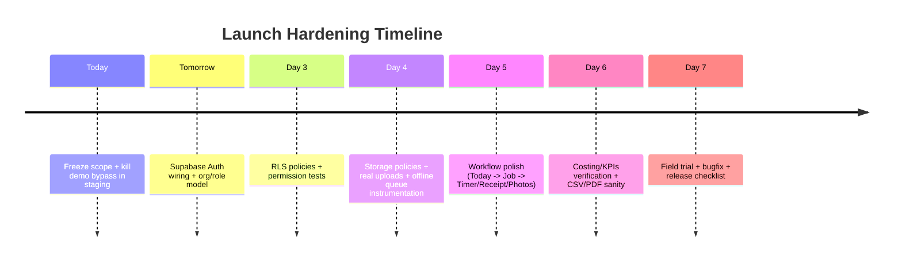
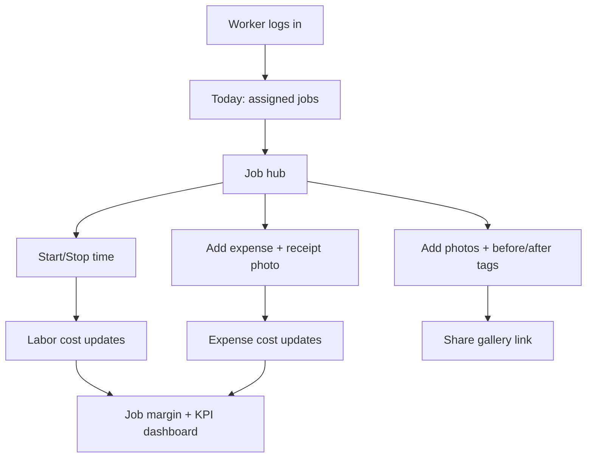

# Turning your current build into a field-ready contracting app

## Executive summary

You already have the hardest part—breadth of functionality—scaffolded: a mobile-first Next.js PWA with a comprehensive Prisma schema, offline queue utilities, job hub routes, costing/KPIs, exports, and PDF endpoints. The reason it doesn’t feel “well-made” yet is not missing features; it’s missing **production invariants**: real auth, real Row Level Security, real migrations, real persistence flows, and a consistent “happy path” UX that matches jobsite reality. citeturn0search0turn0search8turn0search2

To make it actually useful (and safe) next week, the winning strategy is:

- **Freeze scope** around the daily drivers: time + receipts + photos + job hub + schedule + invoice status + job margin + 5 KPIs.
- Replace “demo-safe mode” with a **proper staging environment and feature flags**, so you test the real database and storage every day.
- Implement RLS end-to-end (org isolation + worker assignment rules), because RLS becomes your long-term “seatbelt” as you add workers and clients. Supabase frames RLS as “defense in depth” even if your app layer has bugs. citeturn0search0turn0search4
- Make offline capture reliable by treating it as a **queue + observability problem**, not a UI trick. IndexedDB is designed for offline storage of structured data including blobs, and service workers enable offline experiences by intercepting requests and caching assets. citeturn3search0turn3search1turn3search3
- Use deterministic, verifiable workflows + tests (especially for costing, uploads, and permissions). Cursor’s own guidance for agents emphasizes clear objectives and verifiable signals (types/tests) to keep velocity without losing quality. citeturn4search0turn4search4

If estimates currently originate in entity["company","Joist","contractor invoicing app"], don’t block launch trying to “integrate perfectly.” Joist provides export workflows for estimates/invoices and also has a QuickBooks sync feature (paid tiers). That supports a pragmatic launch: operate your jobs/costing/photos/time in your app, keep estimating/invoicing in Joist for a couple weeks, and import/export until you decide to replace it. citeturn0search7turn0search21turn0search11

## Current state diagnosis

Your “built so far” list strongly suggests you have a functional prototype with three major structural gaps:

### Demo mode is masking the real system

Demo-safe mode helped you iterate UI, but it also prevents you from validating the real failure modes: auth edge cases, RLS, storage permissions, migration drift, and offline upload retries. Once you switch it off, you’ll likely discover “unknown unknowns” around uploads, policy failures, and schema mismatch. This is normal, but it must be surfaced quickly by running against a real environment daily. citeturn0search0turn0search1

### Security and tenant isolation are not yet real

Until Supabase Auth and RLS are implemented end-to-end, you don’t have safe multi-user operation. Supabase explicitly positions Auth + RLS as the mechanism for end-to-end authorization from browser to database. citeturn0search8turn0search0

### Schema and migrations need to be “production-shaped”

You already modeled many entities in Prisma (good), but you’ve flagged “migrations not finalized” and “models added late.” This is a classic “schema drift” issue. Prisma’s production guidance is to apply pending migrations using `prisma migrate deploy` as part of CI/CD, rather than development workflows. citeturn0search2turn0search14

The net: you have a strong feature prototype, but the system is not yet execution-ready because the underlying guarantees aren’t established.

## Fix plan to become field-usable

This plan is written for “launchable next week” constraints: minimal re-architecture, maximum stabilization.

### Must-fix before any real field use

These items are the “seatbelts.” Without them, you’ll lose data or risk exposure.

| Workstream | Concrete deliverable | Why it matters |
|---|---|---|
| Auth reinstatement | Supabase Auth on, login required, demo bypass replaced with roles/fixtures | Supabase supports multiple auth methods; you need real identities for RLS. citeturn0search8 |
| RLS end-to-end | RLS enabled on all org tables; policies for owner/admin/worker; job assignment gating | Supabase emphasizes RLS as defense-in-depth authorization at the database layer. citeturn0search0turn0search4 |
| Migration hardening | “One true path” for schema: Prisma migrations committed + applied using `migrate deploy` | Prisma’s docs recommend `migrate deploy` for production/test environments and CI/CD. citeturn0search14turn0search2 |
| Storage upload correctness | Storage bucket policies tested with real users + RLS; receipts/photos truly upload and read | Standard uploads are suited for small files; reliability strategy must be deliberate. citeturn0search1turn0search5 |
| Offline queue reliability | IndexedDB-based queue + observable retry + resolution states (“pending/synced/failed”) | IndexedDB supports large offline structured storage including blobs; service workers support offline UX. citeturn3search0turn3search1turn3search3 |

**Time estimate (solo dev + Cursor assistance):** 2–4 focused days, because it’s mostly wiring + policy debugging + “painful but finite” edge cases. Cursor Agents can accelerate multi-file refactors and verification if you give pass/fail signals (tests). citeturn4search0turn4search4

### Launch-week stabilization (the stuff users notice immediately)

These are the items that make it feel like a “real tool,” not a dev admin panel.

| Area | What “done” looks like in the field |
|---|---|
| Workflow polish | Today → Job hub → Start timer / Add receipt / Add photos are each ≤ 2 taps from the job hub |
| “No surprises” forms | Short forms on mobile; progressive disclosure for advanced metadata |
| Error states | Every action has: loading, success toast, failure state with retry |
| Closeout checklist enforceable | Can’t mark job “Completed” unless minimum artifacts exist (e.g., at least one end-of-job photo + final invoice status) |
| Costing & KPIs sane | Margin calculations match your definitions; five KPIs update reliably from real DB data |

**Time estimate:** 2–3 days depending on how much UI refactoring is needed.

### Post-launch hardening (do not block launch)

These are valuable but should not hold up field use.

- Full preview-mode “client portal,” beyond share links
- Advanced payroll exports and approvals (beyond summaries)
- AI assistant / agent features
- Deep change order workflows and multi-stage invoicing packages

## Security, data integrity, and “no-data-loss” architecture

### Supabase Auth + RLS should become your core contract

Supabase Auth exists to authenticate users; Supabase RLS exists to authorize at the database row level. The key to making your app robust is to treat **RLS as the product boundary**, so even if a UI route has a bug, users cannot read/write what they shouldn’t. citeturn0search8turn0search0turn0search4

A practical approach that stabilizes quickly:

- Every table has `org_id`.
- A user’s org membership and role live in `org_members`.
- `jobs` access for workers is constrained by `job_assignments`.

Then your policies become “simple SQL truths” you can test.

### Migration discipline: one generate path, one deploy path

Prisma’s guidance for production workflows centers on committing migrations and applying them using `prisma migrate deploy`, typically as part of CI/CD rather than locally against production. This directly addresses your “data model vs execution mismatch” pitfall. citeturn0search14turn0search2

A stabilizing practice for your repo:

- Development: generate migrations via dev workflow, commit them.
- Staging & production: only run `prisma migrate deploy`.
- Add a “schema drift check” job in CI that fails if schema is not purely derived from committed migrations (this is a common pattern; even Prisma community guidance reinforces not using dev migrations in production). citeturn0search2turn0search14turn0search6

### Storage reliability: standard vs resumable uploads should be intentional

Receipts and photos are your “evidence layer,” and they fail in the real world because of network conditions. Supabase documents standard uploads and explicitly recommends resumable uploads (TUS) for better reliability on files above small sizes. citeturn0search1turn0search5turn0search9

Launch-week practical rule:

- Use standard upload for small images after client-side compression.
- For larger uploads (or when network is weak), use resumable uploads (TUS) or ensure your offline queue always retries safely. citeturn0search5turn3search0

### Offline capture: constrain “offline” to what matters

Don’t try to make the whole app offline. Make **capture** offline:

- Store pending receipt/photo blobs + metadata in IndexedDB (designed for significant client-side storage including blobs). citeturn3search0turn3search2
- Keep the UI responsive and show “Pending uploads: N”
- Sync engine retries when online; failures persist with a reason and a “retry” action

Support infrastructure:

- A `sync_logs` table that records: user, device id, asset id, error code, retry count.
- A “Sync health” admin page for you.

Service workers are your offline shell: they sit between app and network and help enable offline experiences and caching strategies. citeturn3search1turn3search3turn3search5

## Joist + QuickBooks integration reality and launch strategy

You called out the biggest friction point: your real estimate intake is currently Joist.

### What Joist gives you today

Joist explicitly supports exporting estimate/invoice data from their web interface for accounting/record-keeping. citeturn0search7  
Joist also markets built-in QuickBooks sync, and their support docs indicate QuickBooks Sync is available on paid tiers (Pro/Elite). citeturn0search11turn0search21

This implies a launch-ready, low-friction approach:

- Keep estimating + invoicing where you already operate (Joist), at least initially.
- Use your app for ops: scheduling, photos, receipts, time, job costing, KPIs.
- Pull financial “truth” via:
  - manual entry of estimate totals into your job record, or
  - periodic import from Joist export CSV, if its export format supports it reliably. citeturn0search7

### Why you should avoid building a “Joist API integration” right now

Joist’s public-facing support emphasizes exports and built-in QuickBooks sync rather than a public developer API. In addition, Zapier community guidance indicates Joist does not have a public Zapier app, which is a common signal that an external automation ecosystem is limited. citeturn0search7turn0search21turn2search3

That does not mean integration is impossible; it means **it’s unlikely to be the fastest path to field usability next week**.

### QuickBooks workflow: treat accounting as source of truth, don’t fight it

Given your earlier preference, the cleanest v1 accounting posture is:

- Your app tracks job costs and operational margin *internally* for daily decisions.
- Accounting system remains the source of truth for tax bookkeeping.
- Export from your app: invoices summary, expenses, time summaries as CSV.  
- Optionally, later: implement direct QuickBooks Online API integration (OAuth + invoice/payment push), but don’t block launch.

This aligns with your “no nonsense” requirement: daily use needs visibility and capture, not perfect bi-directional accounting sync.

## Launch plan with acceptance tests and a Cursor execution script

### What “useful next week” means in measurable terms

A field-ready v1 is achieved when these acceptance tests pass on real devices:

1. A worker can log in, see only assigned jobs, start/stop a timer, and the time entry appears in costing. citeturn0search0turn0search8  
2. A worker can take a receipt photo offline, enter amount, and later it syncs automatically when online, creating an expense tied to a job. citeturn3search0turn0search1  
3. Photos upload reliably, are tagged, and a share link shows only client-visible assets. citeturn0search1turn0search0  
4. Owner dashboard shows five KPIs and each is traceable to real DB rows (no mock assumptions).  
5. Prisma migrations apply cleanly to staging via `prisma migrate deploy`; seed runs; no drift. citeturn0search14turn0search2

### Milestone timeline



### Core flow you’re launching



### Cursor execution script

Because you already have code, the most effective way to use Cursor now is to run it as a refactor-and-hardening agent with strict pass/fail. Cursor’s docs emphasize that agents can run commands and edit code; their best-practices guidance stresses planning and verifiable goals. citeturn4search0turn4search4

Use this as your next Cursor prompt (paste into a single Agent run, then iterate per module):

```text
You are Cursor Agent. Objective: convert this prototype into a field-usable v1 in 7 days.

RULES:
- Do not add new features unless required for daily workflows.
- Delete/replace demo mode shortcuts with a real staging environment setup.
- Output a “Hardening PR” with checklists and passing scripts.

STEP 1: INVENTORY + PLAN
- Scan the repo and produce:
  - list of demo bypass points and mock data fallbacks
  - current Prisma schema and migration status
  - current Supabase client usage patterns
  - offline queue implementation details
- Propose an ordered plan where every step ends in a verifiable command or test.

STEP 2: AUTH + ROLES
- Re-enable Supabase Auth everywhere.
- Implement org membership + role extraction.
- Ensure server-only service keys never reach the client.

STEP 3: RLS
- Enable RLS on all tables.
- Implement policies for owner/admin/worker and job assignments.
- Add a script test that proves workers cannot access unassigned jobs.

STEP 4: MIGRATIONS
- Make Prisma migrations the single source of truth.
- Ensure staging uses `prisma migrate deploy` and seed works.

STEP 5: STORAGE + OFFLINE
- Validate standard upload with real auth.
- If file sizes are >6MB or networks are unstable, implement resumable uploads (TUS) OR ensure offline queue retries reliably.
- Add sync logs and a visible “pending/failed” UI state.

STEP 6: WORKFLOW POLISH
- Make Today -> Job -> Timer/Receipt/Photos the fastest path.
- Add consistent loading/error states.

STEP 7: RELEASE CHECKLIST
- Write a launch checklist: env vars, buckets, migrations, seed, smoke tests.
- Produce a short “Field Trial Script” for workers to follow.
```

This turns your current work into a controlled hardening sequence instead of another round of feature drift.

---

If you want, paste your repo structure (top-level folders + key files like `prisma/schema.prisma`, your demo mode switches, and how you’re instantiating the Supabase client). I can turn the plan above into a **file-by-file hardening checklist** that maps exactly onto what you have now, including the RLS policies and the staged rollout approach.