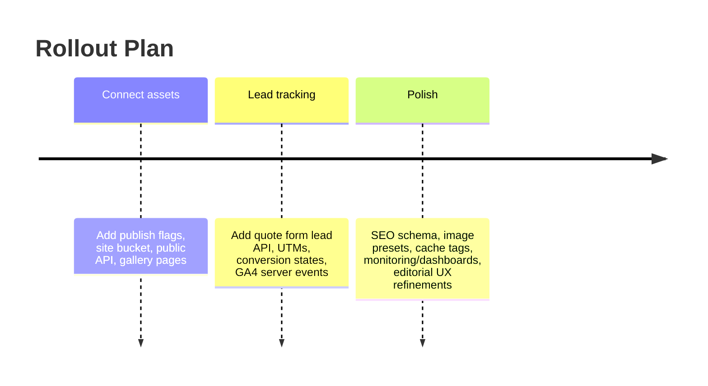

# Syncing your job-management app with a public website/CMS

## Executive summary

A production-ready “next week” solution is to treat your app as the **system of record**, and your public website as a **curated projection** of only what’s explicitly published (photos, galleries, job highlights, and leads). The plan that ships fastest and stays safest is:

- **Store internal job assets privately**, and create a **separate public publishing surface** (either a dedicated “public site” storage bucket or a sanitized “published_assets” projection) so you never accidentally leak client/private photos. This aligns with how Storage access control and RLS are intended to be used for fine-grained permissions. citeturn0search1turn0search9  
- Use a **push-to-publish** workflow from mobile: “Publish to Website” toggles create/update records in your DB, copy/derive the image into a public delivery path, then notify the website to **revalidate caches** (ISR/tag-based invalidation) via webhooks. Cache invalidation is a first-class concept in Vercel’s data cache and Next’s `revalidateTag`/`revalidatePath`. citeturn3search5turn3search2turn3search16  
- Serve images through **CDN-backed asset hosting**. Supabase Storage is CDN-cached by default and its Smart CDN automatically invalidates on update/delete (typically within a minute), which makes “publish/unpublish” and “replace hero image” practical without manual CDN purge work. citeturn3search10turn3search3  
- Track lead-to-job conversion with **UTM-captured leads** plus optional server-to-server analytics via GA4 Measurement Protocol (so you can track conversions even if client-side tracking is blocked). citeturn1search3turn1search11  

This report provides integration patterns (push vs pull vs CDN), a production mapping model, endpoint/webhook designs with retry/backoff, security rules (signed URLs/RLS/CSP/CORS/rate limits), SEO/structured data guidance, CMS option comparisons, caching/invalidation options, a 3‑phase rollout, and code snippets you can implement next week.

## Integration patterns and the recommended architecture

### Push vs pull vs CDN-hosted assets

**Pull (site fetches from your app API)**  
The website queries your app’s “public projection” endpoints at build time (SSG) or request time (ISR/SSR). This is the simplest conceptual model and works with any CMS or even no CMS, but you must implement caching and ensure only “published” data is exposed. Vercel’s data cache persists across deployments and supports on-demand/tag revalidation, which pairs well with pull. citeturn0search3turn3search5  

**Push (your app pushes into a CMS)**  
When you publish a gallery/photo/job highlight in the app, your backend creates/updates the corresponding CMS entry:
- For WordPress, this is typically `wp/v2/posts` and `wp/v2/media`, authenticated via Application Passwords over HTTPS (Basic Auth). citeturn3search0turn3search1turn1search8  
- For headless CMS platforms, webhooks and API calls are the normal pattern (Sanity and Contentful both provide webhook systems). citeturn1search1turn1search2  

Push is best when you want non-technical editing in the CMS, editorial workflows, and preview tooling—but it adds integration surface area.

**CDN-hosted assets (site references stable asset URLs)**  
Your site embeds images via a stable public URL (best for SEO/social and caching). Supabase Storage assets are CDN-cached, and Smart CDN will auto-invalidate on updates/deletes (including transformed images), which reduces operational burden. citeturn3search10turn3search3  

### Recommended “next week” architecture for your app

For speed, safety, and real-world reliability, implement **hybrid pull + CDN assets**:

- **Your app DB is system of record** (file metadata, tags, publish status, alt text, job highlight copy, lead tracking).
- **Public website pulls only published records** from a small, purpose-built “Public Site API” (REST endpoints).
- **Published images are served via a public delivery path**:
  - Default: Supabase Storage + Smart CDN + (optional) built-in image transformations for responsive sizes. citeturn3search3turn2search1  
  - Alternative: S3 + CloudFront if you want maximum ecosystem flexibility or already run on AWS; use presigned URLs for controlled access or CloudFront for public delivery. citeturn0search2turn4search3  

This design keeps your internal job-management workflow separate from public marketing content, which is the main privacy/safety risk in contracting.

## Storage, public access rules, and privacy boundaries

### “Never leak client-private photos” rule

Define a hard boundary:

- **Internal assets**: receipts, jobsite photos, documents → private by default.  
- **Public website assets**: only assets explicitly marked “published to site” and sanitized (no client name/address, no invoice screenshots, no permit docs).  

Supabase emphasizes access control via RLS policies on `storage.objects` (and companion tables), enabling fine-grained control of who can read/write files. citeturn0search1turn0search5  

### Two robust patterns for public delivery

**Pattern A: Separate public “site” bucket (recommended)**  
- Bucket is public (or otherwise publicly accessible by design).
- Publishing copies/derives the asset into the site bucket.
- Website uses stable URLs; SEO/social caching is straightforward.
- Unpublish deletes from site bucket (or marks record unpublished; optionally keep file but remove references).

Supabase Storage is cached on a CDN; Smart CDN invalidates on file change events, so replacing a published photo is manageable. citeturn3search10turn3search3  

**Pattern B: Private bucket + signed URLs (use when you must restrict access)**  
- Website calls your App API to request a signed URL for each asset.
- Supabase’s `createSignedUrl` creates a time-limited URL; it requires `select` permission on the objects table under your RLS model. citeturn0search0turn0search5  
- Great for client portals or share links, but usually suboptimal for public SEO pages (URLs expire, harder caching, more server calls).

### Image optimization and responsive sizes

For a next-week production site, you need:
- consistent aspect ratios (1:1, 4:5, 16:9, 9:16)
- mobile-friendly thumbnails and faster LCP
- an approach that won’t explode costs

Supabase supports **image resizing/optimization** and documents that “any image stored in your buckets can be transformed and optimized,” with image resizing enabled on paid tiers. citeturn2search1turn2search5  

If your site is deployed on Vercel, be aware that Vercel also prices image optimization/transformations as a metered feature; this is a cost lever you should consciously choose. citeturn6search19turn6search3  

Recommendation: **use Supabase image transformations for published portfolio assets** (stable public URLs + transformations) to minimize repeated transformations and keep caching predictable. citeturn2search1turn3search3  

## Data model mapping: app entities to website pages

### Mapping goals

You want the public site to show:
- service pages (e.g., kitchen renovation, drywall repair)
- portfolio pages (categories, highlights)
- individual job highlight pages (sanitized case studies)
- embedded galleries (before/after sets)
- quote form leads that track conversion through your pipeline

### Minimal DB additions for an effective sync layer

Add these tables/columns (names are suggestions):

- `site_pages`
  - `id`, `slug`, `page_type` (`service|portfolio|job_highlight`), `title`, `status` (`draft|published`), `cms_provider` (nullable), `cms_entry_id` (nullable), `updated_at`
- `site_assets`
  - `id`, `file_asset_id`, `published_status`, `published_at`, `unpublished_at`, `site_bucket_path`, `alt_text`, `caption`, `primary_category`, `secondary_tags[]`
- `site_galleries`
  - `id`, `gallery_id`, `slug`, `title`, `description`, `hero_asset_id`, `status`
- `page_assets` (many-to-many)
  - `page_id`, `site_asset_id`, `role` (`hero|grid|before|after`), `sort_order`
- `leads`
  - add: `utm_source`, `utm_medium`, `utm_campaign`, `utm_term`, `utm_content`, `landing_path`, `referrer`, `gclid`, `fbclid`, `external_lead_id`, `source` (enum), `site_session_id`
- `lead_events` (optional but powerful)
  - `lead_id`, `event_type` (submitted, qualified, estimate_sent, converted), `occurred_at`, `metadata_json`

### Mapping table: app entities → website content

| App entity | Public site representation | Mapping method | Common pitfalls |
|---|---|---|---|
| `file_assets` | “Published photo” | `site_assets.file_asset_id` + `publish_status` | Exposing client names in captions; leaking EXIF GPS |
| `galleries` | Gallery embed + gallery page | `site_galleries.gallery_id` + `slug` | Expired signed URLs if you don’t use public bucket |
| `jobs` | Job highlight page (sanitized) | `site_pages` row with `job_id` reference (or `job_public_id`) | Accidentally including address/client identity |
| `share_links` | Internal client portal links | Keep separate from public site publishing | Mistaking “client share link” for “public portfolio” |
| `leads` | Quote form submissions | Direct insert via public endpoint | Spam if you don’t rate-limit + CAPTCHA |

## Public Site API contract and examples

You can implement this as REST for next-week speed. GraphQL is possible but adds overhead unless your CMS requires it.

### Endpoint inventory table

| Capability | Endpoint | Auth | Notes |
|---|---|---|---|
| Publish photo (or set of photos) | `POST /api/site/publish` | HMAC/JWT service token | Creates/updates `site_assets`, copies to site bucket |
| Unpublish | `POST /api/site/unpublish` | HMAC/JWT service token | Marks unpublished and triggers site revalidation |
| Fetch gallery | `GET /api/public/galleries/{slug}` | Public | Returns sanitized gallery metadata + public URLs |
| Fetch job highlight summary | `GET /api/public/jobs/{slug}` | Public | Returns SEO-safe content only |
| Submit lead | `POST /api/public/leads` | Public + rate limit | Captures UTMs/referrer, optional server-side GA |
| Mark lead converted | `POST /api/site/leads/{id}/converted` | Auth (admin) or signed service token | Sets `converted_at`, links to job/customer |

### Example: publish photo payload

**Request**

```json
POST /api/site/publish
Authorization: Bearer <SHORT_LIVED_JWT_OR_HMAC_TOKEN>
Content-Type: application/json

{
  "action": "publish_asset",
  "fileAssetId": "7a8f7c2a-9c2b-4d49-94b3-1d46e6ff2d08",
  "altText": "Kitchen remodel after: white shaker cabinets with quartz countertops",
  "caption": "Full kitchen refresh with new cabinets, counters, and lighting.",
  "categories": ["kitchens"],
  "tags": ["after", "cabinets", "quartz", "lighting"],
  "publishTo": {
    "siteBucket": "site-public",
    "transformPreset": "portfolio_4_5"
  },
  "invalidate": {
    "revalidateTags": ["portfolio", "kitchens"],
    "revalidatePaths": ["/portfolio", "/services/kitchen-remodeling"]
  }
}
```

**Response**

```json
{
  "ok": true,
  "siteAssetId": "1ee87ed0-4b77-4c52-9c7b-7a6a3b0eaa4e",
  "publicUrl": "https://<cdn>/storage/v1/object/public/site-public/org/<orgId>/portfolio/1ee87...jpg",
  "publishedAt": "2026-02-23T21:40:00.000Z"
}
```

### Example: fetch gallery response

```json
GET /api/public/galleries/kitchen-remodel-reading-2026

{
  "slug": "kitchen-remodel-reading-2026",
  "title": "Kitchen Remodel — Reading, PA",
  "summary": "Cabinet refresh + quartz + lighting upgrade.",
  "items": [
    {
      "id": "1ee87ed0-4b77-4c52-9c7b-7a6a3b0eaa4e",
      "alt": "Kitchen remodel after: white shaker cabinets with quartz countertops",
      "stage": "after",
      "url": "https://<cdn>/...jpg",
      "srcset": {
        "w480": "https://<cdn>/...&width=480",
        "w960": "https://<cdn>/...&width=960"
      }
    }
  ]
}
```

This ties directly into Supabase’ signed URL approach (if you choose it) or public bucket approach; signed URLs are explicitly time-limited. citeturn0search0turn0search5  

### Example: lead submission payload + conversion

**Lead submission**

```json
POST /api/public/leads
Content-Type: application/json

{
  "name": "Jamie Rivera",
  "phone": "+1-610-555-0123",
  "email": "jamie@example.com",
  "service": "kitchen_remodel",
  "message": "Looking for a quote for cabinets + countertops.",
  "addressZip": "19601",
  "utm": {
    "source": "facebook",
    "medium": "paid_social",
    "campaign": "kitchen_offer_feb",
    "content": "carousel_2"
  },
  "landing": {
    "path": "/services/kitchen-remodeling",
    "referrer": "https://www.google.com/"
  }
}
```

**Mark converted**

```json
POST /api/site/leads/lead_123/converted
Authorization: Bearer <ADMIN_OR_SERVICE_TOKEN>
Content-Type: application/json

{
  "jobId": "job_789",
  "customerId": "cust_456",
  "conversionValue": 18500,
  "conversionCurrency": "USD"
}
```

### Conversion analytics: server-side events

GA4 Measurement Protocol is explicitly intended to send events directly to GA servers via HTTP to augment client-side collection and enable server-to-server/offline measurement. citeturn1search3turn1search11  

Use it to send:
- `lead_submitted`
- `lead_qualified`
- `lead_converted`

…and include UTMs and a stable lead identifier as event parameters.

## Webhooks, retries, and cache invalidation

### Webhook design

You need webhooks in two directions:

**App → Website (recommended for next week)**  
When publish/unpublish happens, call your website’s webhook to:
- revalidate pages/tags (Vercel ISR)
- purge Netlify cache tags (if you deploy there)
- optionally invalidate CloudFront paths (if using AWS)

Vercel documents on-demand and tag-based revalidation and that cache persists until invalidated by APIs such as `revalidateTag`/`revalidatePath`. citeturn3search5turn3search9  

**CMS → Website (if using headless CMS for page copy)**  
Sanity and Contentful both provide webhook systems to trigger rebuild/revalidate flows. citeturn1search1turn1search6  

### Retry/backoff strategy (production-safe)

Use a durable “outbox” queue on your app side:

- `outbox_events` table: `id`, `type`, `payload`, `attempt_count`, `next_attempt_at`, `last_error`, `status`
- Worker job (cron or background): sends webhook; on failure:
  - exponential backoff (e.g., 1m, 5m, 15m, 1h, 6h)
  - after N failures, move to **dead-letter** status and alert

If you want “push on DB write,” Supabase Database Webhooks can publish events on insert/update/delete after row changes, which you can leverage for publishing state changes without writing your own trigger infrastructure. citeturn3search13  

### Webhook authentication and signing

Avoid using service-role keys between systems. Prefer:

- **HMAC-signed webhooks**  
  - Sender includes `X-Signature` header = HMAC_SHA256(secret, rawBody)
  - Receiver re-computes and verifies
- **Short-lived JWT** between your app and website for privileged calls

Sanity provides a webhook toolkit which validates signed webhook requests, illustrating the ecosystem’s standard approach (signed requests). citeturn1search12  

### CDN invalidation options table

| Hosting/CDN | Method | Pros | Cons | Primary sources |
|---|---|---|---|---|
| Supabase Smart CDN | Automatic invalidation on file update/delete | Lowest ops burden; works with signed URLs too | Browser caches may still need cache-busting if headers long-lived | citeturn3search3 |
| Vercel | `revalidateTag` / `revalidatePath` + cache docs | Great for ISR/SSG content updates | Must design tags/paths carefully | citeturn3search16turn3search2turn0search3 |
| Netlify | Cache tags + purge API | Granular purge at edge | Requires adding cache-tag headers | citeturn2search4turn2search3 |
| CloudFront | Invalidation API | Works for any origin; wildcard invalidation supported | Costs after free paths; operational overhead | citeturn4search3turn6search5 |

## SEO, image markup, and structured data for portfolio pages

### Structured data priorities

For a contractor site, the structured data that pays off fastest is:

- **LocalBusiness** (identity, phone, address, hours)  
  - Schema.org defines LocalBusiness as a type under Organization/Place. citeturn2search2  
  - Google documents Local Business structured data benefits (knowledge panel and related features). citeturn2search6  
- **Service** for service pages (kitchen remodeling, drywall, etc.). citeturn2search9  
- **ImageObject** for portfolio images (alt text, publication metadata). citeturn2search13  

### Image optimization strategy

- Generate 2–3 responsive widths (e.g., 480/960/1440) using Supabase image transformations, and store/serve `alt` text alongside each asset. citeturn2search1  
- Keep filenames and slugs human-readable (good for sharing and organization).
- Strip EXIF GPS metadata before publishing (privacy best practice).

### Cache headers and SEO delivery

If your public API returns JSON for SSG/ISR, set caching consciously:
- Vercel documents cache-control header precedence and separate directives like `CDN-Cache-Control` and `Vercel-CDN-Cache-Control`. citeturn4search2  

## CMS options and a next-week rollout plan

### CMS integration options comparison

| Option | Best for | Integration method | Pros | Cons |
|---|---|---|---|---|
| WordPress | You already have WP site + want easy content editing | REST API posts/media + application passwords | Huge ecosystem, editing UX | Headless complexity, plugin variance; securing REST writes matters citeturn1search8turn3search0turn3search1 |
| Sanity | Structured content, dev-friendly, strong webhooks | Webhooks + content API | Powerful modeling + webhook tooling/best practices | Seat-based pricing; you still need integration code citeturn1search1turn6search2 |
| Contentful | Enterprise-grade content platform | Webhooks + delivery/management APIs | Strong docs, broad ecosystem | Limits/pricing can be a factor; webhook limits on some plans citeturn1search2turn5search7 |
| Static/SSG site on Vercel | Maximum performance + control | Pull from your Public API + ISR revalidation | Fast, simple, minimal moving parts | Requires building editorial UI somewhere (could be your app) citeturn3search9turn0search3 |
| Static site on Netlify | Similar to above | Pull + Netlify cache controls/tags | Flexible caching and purge tools | Requires explicit caching strategy for dynamic responses citeturn2search0turn2search4 |

**If CMS is unspecified and you want production next week:** Build the website as a simple SSG/ISR site that **pulls from your app’s Public Site API**, and manage “publish” directly inside your job-management app. This avoids CMS write APIs altogether and still gives you fast updates via revalidation.

### Three-phase rollout timeline



### Minimal downtime migration approach for an existing site

- Phase A: Stand up new `/portfolio` and `/api/public/*` endpoints alongside existing site.
- Phase B: Switch portfolio/navigation links to new pages (no downtime).
- Phase C: Gradually replace old gallery embeds with new gallery embeds and locks.

## Monitoring, security checklist, costs, and code snippets

### Monitoring & observability (must-have for production)

- Structured logs for every publish/unpublish event and every webhook attempt (include correlation ids).
- Outbox retry table + dead-letter queue view.
- Storage upload failure rate dashboard (even a simple admin page).
- Alerting on “DLQ > 0” and “publish failures last 24h.”

### Security checklist

- **CSP**: Set a strict Content-Security-Policy; MDN describes CSP as a control to restrict what resources can load, mitigating XSS. citeturn4search0turn4search4  
- **CORS**: Restrict cross-origin requests; understand preflight behavior and `Access-Control-Allow-Origin`. citeturn4search1turn4search5  
- Do not expose internal endpoints publicly; only `/api/public/*` returns published-only data.
- Rate limit `POST /api/public/leads` (and add CAPTCHA if needed).
- Use HMAC signing for webhooks (constant-time compare).
- Signed URLs only for private assets; public bucket only for explicitly published items.
- Strip EXIF + validate mime types; disallow dangerous uploads (SVG unless sanitized).

### Rough costs (hosting/CDN)

These are the most relevant cost levers for your specific plan:

- Supabase Pro lists included quotas (and overages); egress pricing is documented, including separate uncached vs cached egress charges. citeturn5search0turn5search12  
- Vercel Pro includes defined monthly usage allocations (data transfer and edge requests) and documents overage pricing by region. citeturn5search9turn5search13  
- If you move published assets to S3 + CloudFront:
  - S3 pricing is published; CloudFront invalidations are free for the first 1,000 paths per month, then charged per path. citeturn6search0turn6search5  

### Implementation tasks and time estimate (dev days)

A realistic “next week” delivery breakdown:

- Connect assets (publish + gallery + public API + revalidation): **2–3 days**
- Lead tracking (quote form + UTMs + conversion marking + GA4 server events): **1–2 days**
- Polish (SEO schema + image presets + monitoring + security headers): **2 days**

Total: **5–7 dev days** if you keep CMS writes optional and focus on pull + revalidate.

### Code snippet: server endpoint to generate a signed public URL (Supabase)

This is for **private assets** (client portal, internal share links). For public website delivery, prefer public site bucket.

```ts
// app/api/assets/[assetId]/signed-url/route.ts
import { NextResponse } from "next/server";
import { createClient } from "@supabase/supabase-js";
import crypto from "crypto";

const supabase = createClient(
  process.env.SUPABASE_URL!,
  process.env.SUPABASE_SERVICE_ROLE_KEY!, // server-only
  { auth: { persistSession: false } }
);

function timingSafeEqual(a: string, b: string) {
  const aa = Buffer.from(a);
  const bb = Buffer.from(b);
  return aa.length === bb.length && crypto.timingSafeEqual(aa, bb);
}

export async function POST(req: Request, ctx: { params: { assetId: string } }) {
  // Example: authenticate with shared secret HMAC header from your website backend
  const rawBody = await req.text();
  const sig = req.headers.get("x-signature") ?? "";
  const expected = crypto
    .createHmac("sha256", process.env.SITE_WEBHOOK_SECRET!)
    .update(rawBody)
    .digest("hex");

  if (!timingSafeEqual(sig, expected)) {
    return NextResponse.json({ ok: false, error: "invalid_signature" }, { status: 401 });
  }

  const { expiresInSeconds } = JSON.parse(rawBody || "{}");
  const expires = Math.min(Math.max(expiresInSeconds ?? 900, 60), 3600); // 1m..1h

  // You must enforce your own rule: only issue signed URLs for allowed assets
  // e.g., asset is client-visible OR belongs to a published share link token
  const assetId = ctx.params.assetId;

  // Replace with your DB fetch verifying publish/visibility rules
  const bucket = "job-assets";
  const path = `org/.../asset/${assetId}.jpg`;

  const { data, error } = await supabase.storage.from(bucket).createSignedUrl(path, expires);

  if (error) {
    return NextResponse.json({ ok: false, error: error.message }, { status: 500 });
  }

  return NextResponse.json({ ok: true, signedUrl: data.signedUrl, expiresIn: expires });
}
```

Supabase documents signed URL creation and that it’s used to share for a fixed amount of time, with select permission requirements on `storage.objects` depending on your RLS policy design. citeturn0search0turn0search5  

### Code snippet: webhook handler that revalidates and optionally invalidates CDN

```ts
// app/api/site/webhooks/publish/route.ts
import { NextResponse } from "next/server";
import crypto from "crypto";
import { revalidatePath, revalidateTag } from "next/cache";

function verify(reqBody: string, signature: string) {
  const expected = crypto
    .createHmac("sha256", process.env.PUBLISH_WEBHOOK_SECRET!)
    .update(reqBody)
    .digest("hex");
  return expected.length === signature.length && crypto.timingSafeEqual(Buffer.from(expected), Buffer.from(signature));
}

export async function POST(req: Request) {
  const raw = await req.text();
  const sig = req.headers.get("x-signature") ?? "";
  if (!verify(raw, sig)) {
    return NextResponse.json({ ok: false, error: "invalid_signature" }, { status: 401 });
  }

  const payload = JSON.parse(raw) as {
    revalidatePaths?: string[];
    revalidateTags?: string[];
  };

  for (const tag of payload.revalidateTags ?? []) revalidateTag(tag);
  for (const path of payload.revalidatePaths ?? []) revalidatePath(path);

  // Optional: invalidate CloudFront paths if you use AWS (keep out of v1 unless needed)
  // See CloudFront CreateInvalidation API docs for request shape and CallerReference uniqueness. 

  return NextResponse.json({ ok: true });
}
```

On-demand invalidation with `revalidatePath` and tag-based invalidation with `revalidateTag` are documented for server environments. citeturn3search2turn3search16  
CloudFront invalidation request requirements and uniqueness (CallerReference) are documented in the API reference. citeturn4search3  

### Prioritized endpoint checklist (build in this order)

- `POST /api/site/publish` (asset + gallery publishing)
- `POST /api/site/unpublish`
- `GET /api/public/galleries/{slug}`
- `GET /api/public/jobs/{slug}`
- `POST /api/public/leads` (with rate limit + validation + UTMs)
- `POST /api/site/leads/{id}/converted`
- Outbox worker + DLQ admin view
- Webhook endpoint on the website for revalidation

### Cursor starter snippet (API + webhook)

```text
Build a “Public Site Sync” module in my Next.js app:

- Add DB tables: site_assets, site_galleries, site_pages, page_assets, outbox_events.
- Implement REST endpoints:
  - POST /api/site/publish
  - POST /api/site/unpublish
  - GET /api/public/galleries/[slug]
  - GET /api/public/jobs/[slug]
  - POST /api/public/leads
  - POST /api/site/leads/[id]/converted
- Implement HMAC signing for privileged endpoints and webhooks.
- Implement outbox retry worker with exponential backoff and DLQ.
- Implement Vercel/Next cache revalidation: revalidateTag + revalidatePath.
- Implement publish pipeline: copy/derive internal asset into site-public bucket; store public URL; strip EXIF; store alt text.
- Add tests for:
  - public endpoints never return unpublished or non-client-visible assets
  - webhook signature verification
  - publish/unpublish triggers outbox + revalidation logic
```

### Replit starter snippet (same scope, deployment-first)

```text
In Replit, set up a deployable Next.js API service + public site pages:

- Ensure env vars for Supabase URL, anon key, service role key, webhook secrets.
- Implement the Public Site API endpoints + webhook receiver.
- Add a simple /portfolio page that calls GET /api/public/galleries and uses ISR.
- Add a /quote page that submits to POST /api/public/leads and stores UTMs/referrer.
- Add logging + a simple admin page to view outbox retries and DLQ items.
- Provide a single command to run migrations + seed, then start.
```

